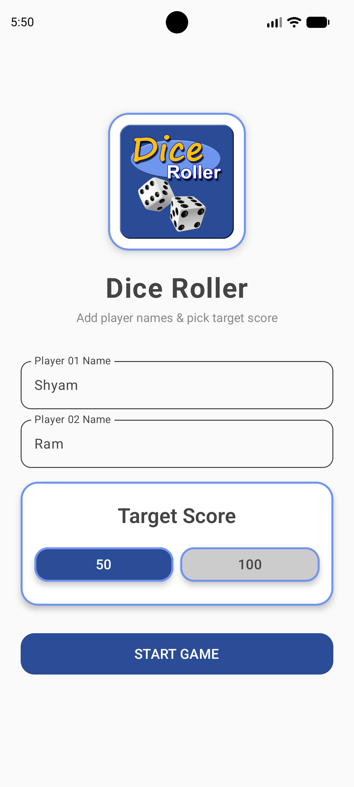
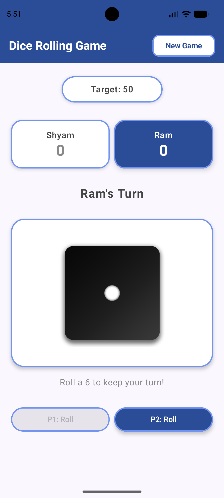
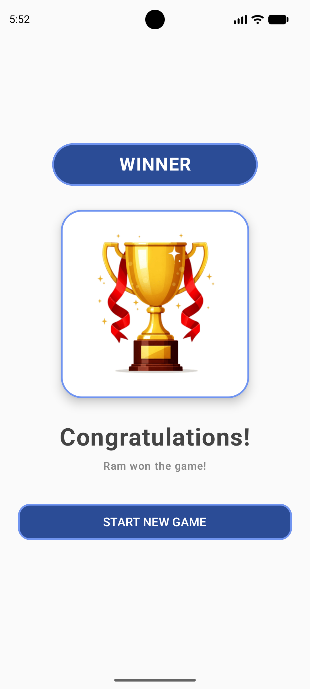
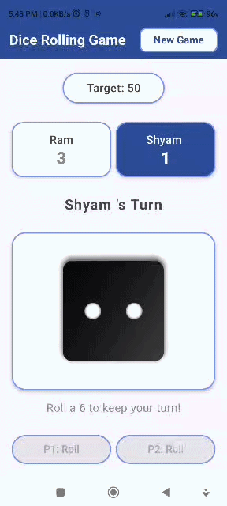

# 🎲 Dice Roller

A modern, two-player dice game built with Jetpack Compose. Players race to reach the target score with a strategic twist: rolling a **6** grants an extra turn!

## ✨ Key Features

- **Type-Safe Navigation:** using Kotlin Serialization and the latest Jetpack Navigation.
- **MVVM Architecture:** Business logic is fully isolated in the ViewModel, ensuring the UI remains stateless and easy to test.
- **Navigation Hoisting:** Screens are decoupled from the Navigation controller using lambdas, making them fully Previewable and modular.
- **Interactive UX:**
    - Coroutine-driven animations using `Animatable` for smooth dice rotations.
    - "Immediate-Lock" logic to prevent button spamming during animations.
    - Real-time input validation (Unique player names, 8-character limits).
- **State Persistence:** Combined use of ViewModel and `rememberSaveable` to ensure the game state survives configuration changes (like rotation).

## 🛠 Tech Stack

- **Language:** Kotlin
- **UI Framework:** Jetpack Compose (Material 3)
- **Architecture:** MVVM (Model-View-ViewModel)
- **Navigation:** Jetpack Navigation Component (Type-safe)
- **Concurrency:** Kotlin Coroutines
- **Serialization:** Kotlinx Serialization

## 🎮 How to Play

1. Enter unique names for Player 1 and Player 2.
2. Select your Target Score (50 or 100).
3. The game randomly selects who starts first!
4. Tap **Roll**; your turn ends unless you roll a **6**—then you get to go again!
5. The first player to reach the target score wins the trophy! 🏆

## 🚀 Getting Started

1. Clone the repository:
    
    ```bash
    git clone https://github.com/omjaiswal7/DiceRollerGame.git
    ```
    
2. Open in Android Studio Ladybug (or newer).
3. Build and Run on a device with API 26 (Android 8.0) or higher.

📸 Screenshots

<p align="center">    </p>

<p align="center">  </p>
